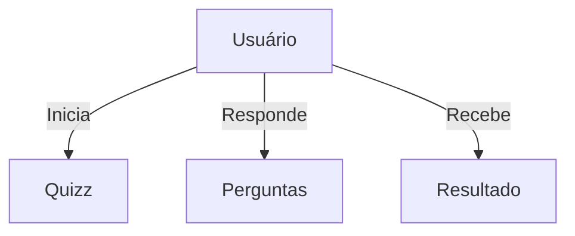

## 🧠 Angular BuzzFeed Quizz 
## Projeto desenvolvido para o Bootcamp DecolaTech da Avanade 2025, em parceria com Dio.

Este projeto é um clone do BuzzFeed Quizz, desenvolvido com Angular. Ele permite que usuários participem de quizzes interativos e recebam um resultado baseado em suas respostas.

---

## 🚀 Tecnologias Utilizadas

- Angular 14.1.2
- TypeScript
- HTML5
- CSS3

---

## 📁 Estrutura do Projeto

```
angular-buzzfeed-quizz-clone/
├── src/
│   ├── app/
│   │   ├── components/
│   │   ├── pages/
│   │   ├── app-routing.module.ts
│   │   ├── app.component.css
│   │   ├── app.component.html
│   │   ├── app.component.ts
│   │   └── app.module.ts
│   ├── assets/
│   ├── environments/
│   ├── favicon.ico
│   ├── index.html
│   ├── main.ts
│   ├── polyfills.ts
│   ├── styles.css
│   └── test.ts
├── .editorconfig
├── .gitignore
├── angular.json
├── karma.conf.js
├── package-lock.json
├── package.json
├── README.md
├── tsconfig.app.json
├── tsconfig.json
└── tsconfig.spec.json
```

---

## 🧭 Diagrama de Casos de Uso



---

## ▶️ Como Executar o Projeto

### Pré-requisitos

- Node.js (versão 14 ou superior)
- Angular CLI instalado globalmente:
  ```bash
  npm install -g @angular/cli
  ```

### Passos para execução

1. Clone este repositório:

   ```bash
   git clone https://github.com/felipeAguiarCode/angular-buzzfeed-quizz-clone.git
   ```

2. Acesse o diretório do projeto:

   ```bash
   cd angular-buzzfeed-quizz-clone
   ```

3. Instale as dependências:

   ```bash
   npm install
   ```

4. Inicie o servidor de desenvolvimento:

   ```bash
   ng serve
   ```

5. Acesse a aplicação no navegador:

   ```
   http://localhost:4200/
   ```

---

## 🤝 Contribuições

Contribuições são bem-vindas! Sinta-se à vontade para abrir uma *issue* ou enviar um *pull request* com melhorias.

---


